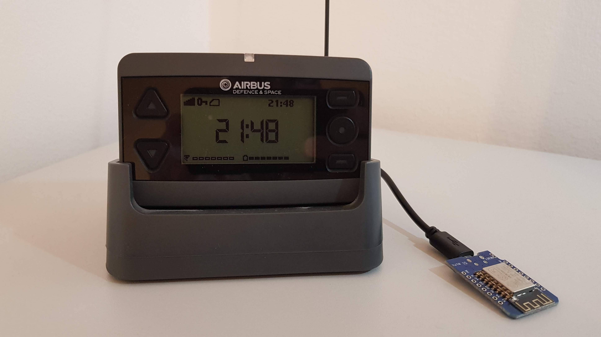

# DiveraESP
Trigger a DIVERA 24/7 alarm via an ESP8266 if your Pager receives an alarm.

## About DIVERA 24/7
DIVERA 24/7 (https://www.divera247.com/) is an alerting and availability system. It uses Hardware to detect if one of the pagers of the fire department receives an alarm. If so this Hardware sends a request to the DIVERA REST API that then Triggers a Push notification on linked mobile phones via an app.
It also keeps track of the availability of first responders.
The Mentioned API can easily be accessed. How? Read the documentation pdf in the documentation folder.

## About DiveraESP
DiveraESP is basically Code that runs on an ESP8266 (for example a WeMos D1 mini) that gets its power via the USB Port of the Pager (if it has one, this is tested with the shown Airbus model) if it receives an alarm. The ESP than interacts with the API and triggers the alert on the mobile phone(s).

There for you need a DIVERA account, a phone, the app and an ESP8266 like the mentioned WeMos one. The documentation tells you everything you need to know about the URLs the ESP8266 is going to send a POST request to.

The URL and the Wi-Fi login has to be changed in the Code in Order to work.

As you can already tell this solution is not perfect because you can't know any details about the alert. You only will know that there is an alert. I work on that.

The DIVERA setup isn't covered here, but I will explain how to flash the code on your ESP8266.

## Dependencies / How to flash
To flash the code on your ESP you need the Arduino IDE (https://www.arduino.cc/en/software). In the IDE you have to install a couple of things.

### Board Manager
You need to install the ESP8266 Board Manager. To do this, go to *File/Preferences* in the IDE and paste the following URL into the board manager URL line. http://arduino.esp8266.com/stable/package_esp8266com_index.json Then go to *Tools/Board: ...* and at the top on *Board Manager...* Search for esp8266 by ESP8266 Community and install the newest version.  The last step is to select the board under *Tools/Board*. For example *LOLIN(WEMOS) D1 R2 & mini* if you use a WeMos D1 mini. If you have problems with the code. Try to use esp8266 in Version 2.7.4.

### Libraries
You also need to install a library.
- NTPClient by Fabrice Weinberg (tested with version 3.2.0)

Here is how to install them. Go to *Tools/Manage Libraries...* and search for the Libraries. Then click install.

### Flash it
If you selected your board like mentioned above then all there's left is to choose the USB Port the ESP is connected to. You can do that by Tools/Port. Then flash it via the arrow button at the top. Done.

## Future changes
- divide the code with classes
- put it all in setup() instead of loop()
- improve the time code
